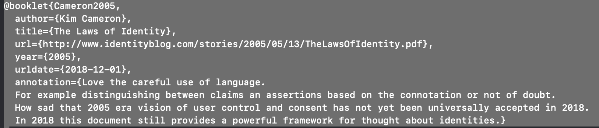

# anno-biblio
IDPro annotated bibliography

Ths system produces a formatted annotated bibliography.  It takes inputs in the form of files following the patterns provided by `biblatex`.

These are structured files which have fields for the components of the citation, such as author, date and so forth.  There is some variety in what is captured depending on the type of reference such as books, videos, web resources.

These files are correlated with some minimal control data, which is stored `.csv` files by means of a naming convention.

In addition the annotators play a prominent role.  For each annotator there is a graphic (intended to be a head shot) and a biopic.

All these elements are put together by running a shell script, `compile.sh`.

The output of the system is a `.pdf` file.  The initial setup is hard coded using U.S. Letter size pages.

## How to contribute

To contribute most effectively, you'll need an account and some basic familiarity with GitHub.  The GitHub help page at https://help.github.com is a good place to get started.

1. Basic Plan
  - Login to Github.com
  - You will create a "fork", which allows you to create and edit files.
  - When you are ready you will create a pull request to get your content incorporated in the base system.
2. You will create a key which by convention is first initial, last name.  If needed add a tiebreaker.
  - Look at `https://github.com/gbd-idpro/anno-biblio/blob/master/contributors.csv` to see if a tiebreaker is needed.
  - While you are in this file, edit it to add an entry for yourself.
  - This should force you to fork the repository.  At the top of the page you should see `youriD / anno-biblio`. All your work will be saved in your fork.
3. Create your bibliography file
  - An example with each type of entry can be seen `https://github.com/cronical/anno-biblio/blob/master/bibs/ssquire.bib`
  - A template file can be found at 
     `https://github.com/cronical/anno-biblio/blob/master/bibs/template/template.bib`
  - Open this file and copy the contents. Go back to the bibs folder and Create new file.
  - Paste the template into the new file. You need to edit the file and put in the references, including your comments in the annotation field.
  - Save this under your key, with the extension of .bib.
4. Create your biographic information and upload a picture.  These are in the bios folder.  The naming convention is key.txt for the bio and key.[jpg|png] for the photo.
5. Finally, create a pull request. Go back to the root of your repository and click `New pull request`
  - Review your work, put in a comment and submit the request.
6. You are done. The maintainer, now needs to accept your pull requests and recompile to the document.

## Mechanism
The control file is `contributors.csv`. It consists of 
`
key,first,last,location,gtype
gdobbs,George,Dobbs,"Hartford, Connecticut, USA area",png`

As shown above the contributors file contains a unique key, the first and last name, the contributors location and a file type for the graphics.  The key is used in the names of various files, such as the graphics file, which in this case will be `gdobbs.png` which is found in the bios folder, along with `gdobbs.txt`, which contains the bio.

Lets  look at the `.bib` files.  These are stored in the bibs folder. These are plain text files, but they can also be edited with specialty editors if desired.  Each file is contains one or more sections similar to:

Each contributor provides citation data and the annotation for as many items as they like in a single file under their `key`.  So this one occurs in the file named `gdobbs.bib` in the `bibs` folder.

This allows for more than one contributor to annotate the same reference.  

The citation also has a key, its the first element after the entry type, in this case, Cameron2005. 

### Temporary files
The `contrib-cites.csv`file is a temporary work file which contains two columns. It is the mapping between the contributors and the citations.  It is generated from the `.bib` files by the `compile.sh` script.

The script also refreshes the temp file `bibs_index.tex` based on the contents of the `contributors.csv` file.  This file is then "included" in the main Latex file, `anbib.tex`.  Thus no changes are needed to the main file when a new contribution arrives.

## To do

1. Prepare introduction and any other front matter

2. Gather more citations.

3. Tweak the formatting 

4. Copy edit the existing text

5. Get some better photos
